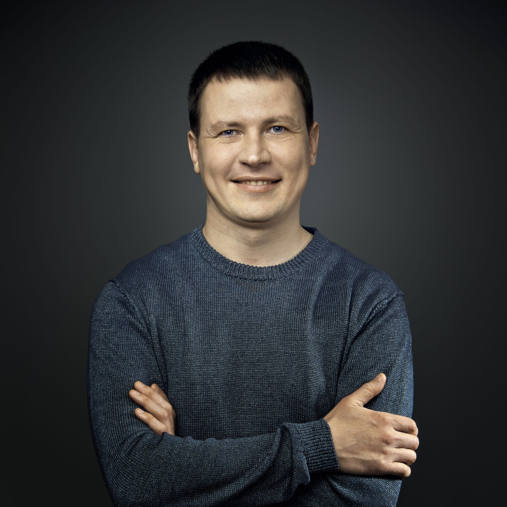

&#8220;A
father, husband, son, and brother. 
I'm 41 with 27 years of work experience. 
A slow fashion webmaster. 
A minimalist.

In 2017 I've discovered a [friendly](words.html) and [supportive
community](sponsors.html) and that's exciting. I've never received
such overwhelming and positive feedback from the internet strangers
before. As a result I'm having more time with my friends and family,
reconnecting with my clients and colleagues from my previous projects
from all over the world, to proudly share my excitement.&nbsp;;)

These days I'm working on things that I can control, therefore I
feel like everything is possible. All I need to keep running is [my
computers](setup.html) and the internet, and maybe travel more
(conferences, meetups, etc).

[Where do I see myself in five years?](cv.html) :) There is a chance
I'll be doing the same at the larger scale. I'll be publishing more
words to connect more people. My business models may change, but
my mission has been solid for decades: I'm [mastering the Web](/n/).

I help internet companies to find people, help my peers to find
their dream jobs, help them to build fast and accessible web and
to work remotely.&#8221;

&mdash; Roman

 _Here I am. Standing still
and smiling at you. Usually I'm walking and talking. Haha, just
kidding, I'm sitting and staring into glowing rectangles most of
the time and I look dead serious._

---

The site is hosted on [OpenBSD Amsterdam](https://openbsd.amsterdam/?rz)
and served by [httpd](/openbsd/httpd.html). All pages are crafted
in Markdown or plain HTML and then rendered into a website by
[ssg](ssg.html).
