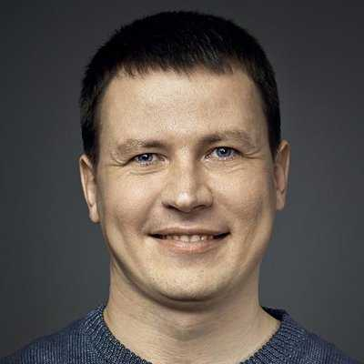

<pre>

           &mdash; Where do you see yourself in five years?
                              &mdash; Here, I guess.
                                      |
                                      |
      -----------------programming . . . . . . . . . .
            -------web-development . . . . . . . . . .
        -----------    --design-ui . . . . . . . . . .
           -------------------unix . . . . . . . . . .

  1990  94  98  02  06  10  14  18  22  26  30  32  36

           --------independent-web . . . . . . . . . .
                       ------b2c
                         adtech
                   -b2b
</pre>

# Roman Zolotarev

<em>An entrepreneur, software developer, minimalist web designer with
the business and <a href="tech.html">technical background</a>.</em>

<a href="https://www.romanzolotarev.com/"
  class="u-url" rel="me">romanzolotarev.com</a> 
<a href="mailto:hi@romanzolotarev.com"
  class="u-email" rel="me">hi@romanzolotarev.com</a> 
<a href="https://twitter.com/romanzolotarev"
  class="u-url" rel="me">twitter.com/romanzolotarev</a> 
<a href="https://bsd.network/@romanzolotarev"
  class="u-url" rel="me">bsd.network/@romanzolotarev</a> 

[BSDjobs]: https://www.bsdjobs.com/
[Cinarra Systems]: https://www.cinarra.com/

## Current projects

**Founder, Technical Writer, Designer, [Mastering the Web](/n/)** 
_Publishing, 2018&ndash;present_ 
[romanzolotarev.com/n/](/n/)

Writing [how-to guides](/) for beginners. 
Advocating simple web development tools on [Twitter] and [Mastodon]. 
Serving [a very kind BSD community](words.html).

[Twitter]: https://twitter.com/romanzolotarev
[Mastodon]: https://bsd.network/@romanzolotarev

Supporting Unix/BSD related projects and [mentoring developers](ref/mk.html).
#IndieWeb #RUNBSD #BSDjobs #OpenBSD &#x1f421; 

Maintaining [a media kit](/openbsd.amsterdam/) and website for
[OpenBSD Amsterdam](https://openbsd.amsterdam). 
Created [a logo](/etsh.io) for [Jeff](words.html#je)'s [Etsh](https://etsh.io/). 
Helping [Mischa](ref/mp.html) to promote OpenBSD Amsterdam.

Writing and maintaining [shell scripts](/bin/) (licensed under
[ISC](https://en.m.wikipedia.org/wiki/ISC_license)).

[arc](/arc.html) &mdash; an archiver 
[diceware](/diceware.html) &mdash; a passphrase generator 
[pass](/pass.html) &mdash; a password manager 
[ssg](/ssg.html) &mdash; a static site generator 

_Why?_ &#29983;&#12365;&#30002;&#26000;  The modern web is slow,
bloated, and intrusive.  Our community (developers,
system administrators, technical writers) must promote high code
standards, support free software projects. For example, OpenBSD
project&mdash;the invisible backbone of the Internet&mdash;software
for routers, firewalls, mail, web, DNS servers, etc.
Who else can save internet kittens?

_Challenges?_ We need to (re-)educate few hundred thousand of web
developers. I heard number of programmers doubles every five years.
So half of us are inexperienced juniors. We'd better keep up.
Everyone should become a tutor.

---

**Founder, [BSDjobs]** 
_Job board, 2018&ndash;present_ 
[bsdjobs.com][BSDjobs]

<pre>
100+ job ads posted
50+ user stories published
First people hired
Profitable since week two :)
</pre>

Selling and [posting job ads][BSDjobs]. 
Promoting BSD companies on [Twitter](https://twitter.com/bsdjobscom). 
Interviewing the community and hosting [user stories](https://www.bsdjobs.com/people/). 

[Raman](ref/rs.html) is inspiring and advising. 
h/t [Reyk](words.html#rf) for being my first customer right after the project launch.

_Why?_ I love to help BSD people to find their dream jobs. More
people run BSD means more BSD projects receive better support. Good
software wins!

_Challenges?_ We need more companies to run BSD, to educate
companies about BSD and its business values, make BSD systems
compatible with existing infrastructure (hardware and software).

---

**Full-stack Web Developer, self-employed** 
_Software development, Russia, 2016&ndash;present_ 
[romanzolotarev.com](/)

Developing software for the web. Managing all strategic and operational
marketing, customer relationship activities, and sales.

---

## Past experience

**Senior User Interface Architect, [Cinarra Systems]** 
_Advertising Technology, Singapore, 2015&ndash;2016_ 
[cinarra.com][Cinarra Systems]

> &#8220;Cinarra is a technology startup that is addressing the changing
economics of an increasingly mobile society. By uniting mobile
operators and their unique "always on" data assets with the advertising
ecosystem. Cinarra unlocks real life data that makes it possible
for advertisers to match campaigns to consumers' activities in the
real world. Through groundbreaking technology, Cinarra is creating
the foundation for a new mobile Internet economy.&#8221;

> Leading investors: SoftBank, Almaz Capital, and Cisco Systems.

I designed, developed, and deployed web applications (ad campaign
management and reporting for advertising agencies).  Hired, on-boarded,
and managed web developers of a frontend team.

My team
([Denis](ref/db.html),
[Raman](ref/rs.html),
[Fred](ref/tda.html), and
[Ivan](ref/is.html))
developed the web application frontend of the ad campaign manager.

[Marat](ref/mt.html) with the backend team designed and implemented
API, database, and web application server.

[Sath](ref/sn.html) orchestrated all engineering teams within the company.

---

**Web Developer, self-employed** 
_Software development, Russia, 2009&ndash;2015_ 
[romanzolotarev.com](/)

Developed software for clients from California, Singapore, Tokyo,
and Moscow. I was focused on frontend development (user interfaces,
user experience, interaction design).

---

**Founder, JumpIDEA** 
_Venture Capital Fund, 2007&ndash;2009_

Managed a team of advisors, handled all communications with angel
investors. Provided help to a dozen of internet startups.

---

**Director, Dubbee** 
_SaaS, Moscow, Russia, 2008&ndash;2009_

Developed online text-to-speech service. Managed relationships with
angel investors. Hired and managed a&nbsp;team of&nbsp;software
developers.

---

**Director, Geotel** 
_System Integrator, Moscow, Russia, 2007&ndash;2009_

Built a content delivery network for telecom companies.

---

**Deputy Director, Microcom** 
_System Integrator, Moscow, Russia, 2006&ndash;2007_

Deployed ERP system for a&nbsp;government agency and managed
a&nbsp;team of&nbsp;engineers and technical writers.

---

**Director, Volga Region CA** 
_Certificate Authority, Kazan, Russia, 2005&ndash;2006_

Provided infosec solutions (e.g. public key infrastructure and
digital signature) to government companies. Managed a&nbsp;team of
security engineers and software developers.

---

**Director, IBN** 
_Web Design Studio, Kazan, Russia, 2000&ndash;2005_

Made and supported websites. Designed, developed, and hosted sites.
Managed a&nbsp;small team.

---

**Web Developer, Center** 
_System Integrator, Kazan, Russia, 1999&ndash;2000_ 

Built software for in-house web applications.

---

**Print and Web Designer, Idel&mdash;Tesma and TSK** 
_Advertising Agencies, Kazan, Russia, 1994-1999_

Designed ads for print, outdoor, and the web.

---

**Network Administrator, School 7** 
_Secondary School, Tchaikovsky, Russia, 1991&ndash;1994_

Maintained the computer network and supported users.

## Education

**Master of Computer Science** 
Kazan National Research Technical University 
_Diploma with honors, Kazan, Russia, 2004_

## References

[
**Alex Zinin**](ref/az.html) 
_Founder_ 
Pr3vision Consulting

[
**Sath Nelakonda**](ref/sn.html) 
_VP of Engineering_ 
Cinarra Systems

[
**Timur Goldobin**](ref/tg.html) 
_Co-founder_ 
Leto24

[
**Mischa Peters**](ref/mp.html) 
_Founder_ 
OpenBSD Amsterdam

[
**Raman Shalupau**](ref/rs.html) 
_Founder_ 
Crypto Jobs List

[
**Marina Kuznetcova**](ref/mk.html) 
_Frontend Engineer_ 
Piano

[
**Denis Borovikov**](ref/db.html) 
_Senior Software Engineer_ 
Cinarra Systems

[
**Tran Dac Anh**](ref/tda.html) 
_Software Developer_ 
Yara

[
**Ivan Starkov**](ref/is.html) 
_Software Developer_ 
RealAdvisor

[
**Marat Tukhvatullin**](ref/mt.html) 
_Software Developer_ 
freshcells systems engineering

[
**Kirill Kouterguine**](ref/kk.html) 
_Serial Entrepreneur_

[
**Ivan Kuznetzov**](ref/ik.html) 
_Chief Executive Officer_ 
Investex

[
**Denis Baranov**](ref/dba.html) 
_Senior Software Developer_ 
adjust

[
**Alexis Nazarbaev**](ref/an.html) 
_Founder_ 
Cyberflash

Also [people are saying...](/words.html)
