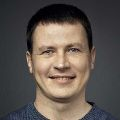

&#8220;Hi, my name is
Roman. 
I'm here to&nbsp;help&nbsp;you with&nbsp;<a href="openbsd/">OpenBSD</a>.

I write [shell scripts](/bin): 
[ssg3](/ssg.html) &mdash; a static site generator 
[rssg](/rssg.html) &mdash; an RSS feed generator 
[form](/form.html) &mdash; a web form handler 
[arc](/arc.html) &mdash; an archiver 
[diceware](/diceware.html) &mdash; a passphrase generator 
[pass](/pass.html) &mdash; a password manager 
[screenshot](bin/screenshot) &mdash; a screenshot tool 
[screencapture](bin/screencapture) &mdash; a screen capture tool 

Support Unix/BSD related projects: 
[OpenBSD Amsterdam](openbsd.amsterdam/) 
[Etsh Project (V6Shell)](etsh.io/)

Dispatch a newsletter: [Mastering&nbsp;the&nbsp;Web](n/)

Oh, and I also publish how-tos.&#8221;

---

**Roman Zolotarev** 
_Die-hard Webmaster_ 
hi@romanzolotarev.com 
[@romanzolotarev](/twitter.html)

---

# How to...

Subscribe via [RSS](https://www.romanzolotarev.com/rss.xml).

- [forward outgoing mail to a remote SMTP server](openbsd/smtpd-forward.html "2018-11-23")
- [mount exFAT file system on OpenBSD](openbsd/exfat.html "2018-11-16")
- [mount file system via Media Transfer Protocol on OpenBSD](openbsd/mtp.html "2018-11-06")
- [upgrade OpenBSD on bare metal](openbsd/upgrade.html "2018-10-18")
- [generate random string with random(4)](random.html "2018-09-27")
- [find and remove whitespaces with grep(1) and sed(1)](ws.html "2018-09-23")
- **[generate RSS feeds with grep(1), sed(1), and awk(1)](rssg.html "2018-09-21")**
- [find disk name and partition with sysctl(1) and dmesg(1)](openbsd/disk.html "2018-09-19")
- [make bootable image geteltorito(1) and dd(1)](openbsd/geteltorito.html "2018-09-12")
- [dock laptop with with xrandr(1), xinput(1), xrdb(1), and sysctl(8)](openbsd/dock.html "2018-09-12")
- [prepare ThinkPad X1&nbsp;Carbon&nbsp;Gen&nbsp;5 for OpenBSD](openbsd/lenovo-thinkpad-x1c5.html "2018-08-13")
- [encrypt disk with bioctl(8) and CRYPTO](openbsd/bioctl-crypto.html "2018-08-12")
- [deploy VM on OpenBSD.Amsterdam](openbsd.amsterdam.html "2018-07-01")
- [publish Git repositories with stagit(1) on OpenBSD](stagit.html "2018-06-07")
- [host Git repositories on OpenBSD](git.html "2018-06-07")
- [manage your terminals with tmux(1)](tmux.html "2018-05-18")
- [edit text with vi(1)](vi.html "2018-05-12")
- [configure newsboat(1) to read RSS feeds in&nbsp;terminal](newsboat.html "2018-05-06")
- [set default programs with xdg-mime(1)](xdg-mime.html "2018-05-01")
- [customize xenodm(1) login screen](openbsd/xenodm.html "2018-05-01")
- [enable HTTPS with acme-client(1) and Let's Encrypt on OpenBSD](openbsd/acme-client.html "2018-04-13")
- [configure httpd(8) on OpenBSD](openbsd/httpd.html "2018-04-12")
- [install OpenBSD on Vultr](/openbsd/vultr.html "2018-04-11")
- **[make a static site with lowdown(1) and rsync(1)](ssg.html "2018-04-07")**
- **[generate passphrases with random(4)](diceware.html "2018-03-30")**
- [change time zone on OpenBSD](openbsd/timezone.html "2018-03-16")
- [archive with borg(1)](borg.html "2018-03-02")
- [mount(1) on OpenBSD](openbsd/mount.html "2018-03-01")
- [print with cups(1) on macOS](macos/cups.html "2018-02-27")
- **[manage passwords with openssl(1) and oathtool(1)](pass.html "2017-10-10")**
- [install OpenBSD on a desktop](openbsd/install.html "2017-09-20")
- [prepare a bootable USB drive with OpenBSD installer on macOS](macos/openbsd-installer.html "2017-09-19")
- [configure login.conf(5) and sshd(8) for YubiKey on OpenBSD](openbsd/yubikey.html "2017-09-01")
- [edit text with Vim](vim.html "2017-08-26")
- [manage passwords with security(1) on macOS](macos/security.html "2017-05-16")
- [generate SSH keys](ssh.html "2017-05-01")
- [host repositories on GitHub](github.html "2017-04-16")
- [make a static site with Jekyll](jekyll.html "2016-11-22")
- [learn touch typing](typing.html "2016-11-19")
- [compare JavaScript, with Ramda, and Elm](js-ramda-elm.html "2016-10-26")
- **[watch screencasts for programmers](screencasts.html "2016-10-25")**
- [edit text with TextEdit.app](macos/textedit.html "2016-09-17")
- [learn Markdown](markdown.html "2016-08-30")
- [start a standalone website](standalone.html "2016-08-23")
- [decide if you need a website](website.html "2016-08-15")

&copy; 2008&ndash;2018 Roman Zolotarev
