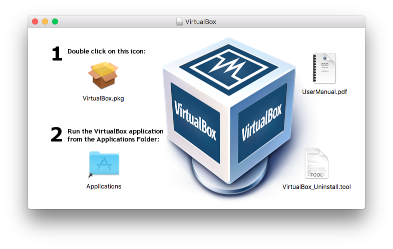
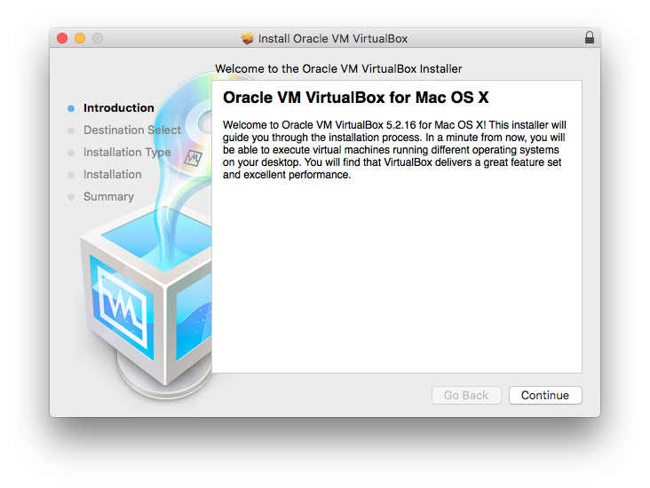
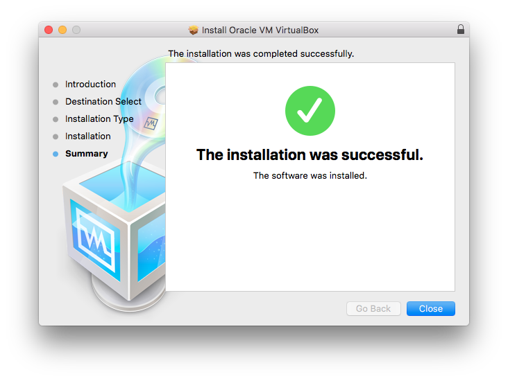
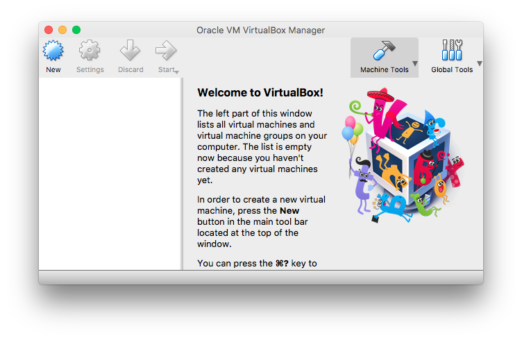

_Tested on [macOS](/macos/) 10.13. [CLI version?](./)_

# Install VirtualBox on macOS

Open [virtualbox.org](https://www.virtualbox.org/) and download
_VirtualBox platform package_ for _OS X hosts_.

## Uninstall

To uninstall VirtualBox you need to run _VirtualBox\_Uninstall.tool_
from _VirtualBox-...-OSX.dmg_.

