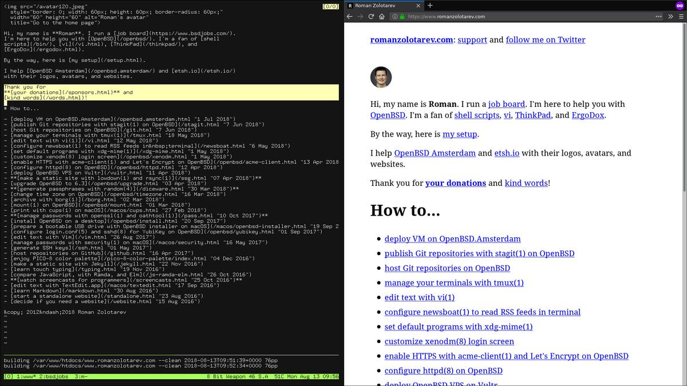

_[Why OpenBSD?](why.html) Simple and secure._

# Run OpenBSD...

## ...on servers

- **[Deploy VM on OpenBSD.Amsterdam](oams.html) &euro;60/year**
- [Install OpenBSD on Vultr](vultr.html) starts at [$2.5/month](/vultr.html) (min $10 deposit), 15 locations
- [Configure httpd(8)](httpd.html)
- [Enable HTTPS with acme-client(1) and Let's Encrypt](acme-client.html)
- [Host Git repositories](/git.html)
- [Publish Git repositories with stagit(1)](/stagit.html)
- [Forward outgoing mail to a remote SMTP server](smtpd-forward.html)

_I heard [ARP Networks](https://arpnetworks.com/vps) provides OpenBSD
VPS for $10/month._

## ...on desktops

- [Try OpenBSD in VirtualBox](/virtualbox/openbsd.html)
- [Pick hardware](hardware.html)
- **[Install OpenBSD](install.html)**
- [Customize xenodm(1) login screen](xenodm.html)
- [Configure login.conf(5) and sshd(8) for YubiKey](yubikey.html)
- [Manage terminals with tmux(1)](/tmux.html)
- [Use X11 clipboard with xclip(1)](/xclip.html)
- [Set default programs with xdg-mime(1)](/xdg-mime.html)
- [Dock laptop with with xrandr(1), xinput(1), xrdb(1), and sysctl(8)](dock.html)

Now I run [-stable](https://www.openbsd.org/stable.html) on [my
desktop](/setup.html) and servers. Servers are supposed to be
reliable, that's obvious, why not run _-current_ on a desktop? Even
six month release cycle is too fast for me. I prefer [slow
fashion](https://www.youtube.com/watch?v=Wiw3YcwGwrU).

My dotfiles
[.xsession](xsession)
[.Xdefaults](Xdefaults)
[.cwmrc](cwmrc)
[.tmux.conf](tmux.conf)
[.exrc](exrc)

## Misc

- [Encrypt disk with bioctl(8) and CRYPTO](bioctl-crypto.html)
- [Archive with mtree(8) and pax(1)](/arc.html)
- [Set time zone](timezone.html)
- [Manage passwords with openssl(1) and oathtool(1)](/pass.html)
- [Edit text with vi(1)](/vi.html)
- [Generate SSH keys](/ssh.html)
- [Mount disks with... mount(1)](mount.html)
- [Mount exFAT file system on OpenBSD](exfat.html)
- [Mount file system via Media Transfer Protocol on OpenBSD](mtp.html)
- [Find disk name and partition with sysctl(1) and dmesg(1)](disk.html)
- [Upgrade OpenBSD](upgrade.html)
- [Upgrade OpenBSD on OpenBSD.Amsterdam](oams-upgrade.html)
- [Upgrade OpenBSD on Vultr](vultr-upgrade.html)
- [Make bootable image geteltorito(1) and dd(1)](geteltorito.html)
