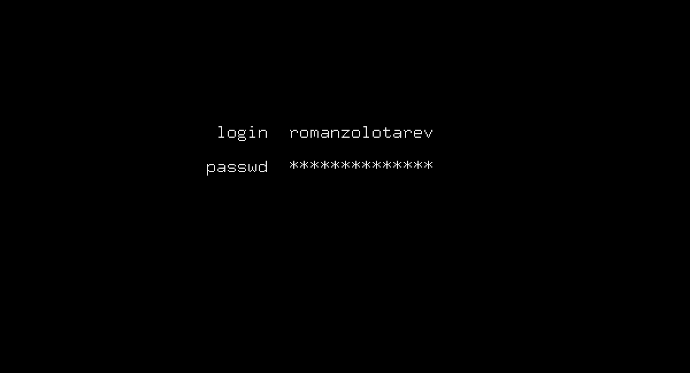

_Tested on [OpenBSD](/openbsd/) 6.3 and 6.4_

# Customize xenodm(1) login screen

Enable [xenodm(1)](https://man.openbsd.org/xenodm.1):

<pre>
# <b>rcctl enable xenodm</b>
#
</pre>

Edit `/etc/X11/xenodm/Xresources`:

	xlogin.Login.echoPasswd:       true
	xlogin.Login.fail:             fail
	xlogin.Login.greeting:
	xlogin.Login.namePrompt:       \040login\040
	xlogin.Login.passwdPrompt:     passwd\040

	xlogin.Login.height:           180
	xlogin.Login.width:            280
	xlogin.Login.y:                320
	xlogin.Login.frameWidth:       0
	xlogin.Login.innerFramesWidth: 0

	xlogin.Login.background:       black
	xlogin.Login.foreground:       #eeeeee
	xlogin.Login.failColor:        white
	xlogin.Login.inpColor:         black
	xlogin.Login.promptColor:      #eeeeec

	xlogin.Login.face:             fixed-13
	xlogin.Login.failFace:         fixed-13
	xlogin.Login.promptFace:       fixed-13

Edit `/etc/X11/xenodm/Xsetup_0`:

	#!/bin/sh
	xsetroot -solid black

Logout to check the login screen.

[Use YubiKey for login and SSH](/openbsd/yubikey.html).
