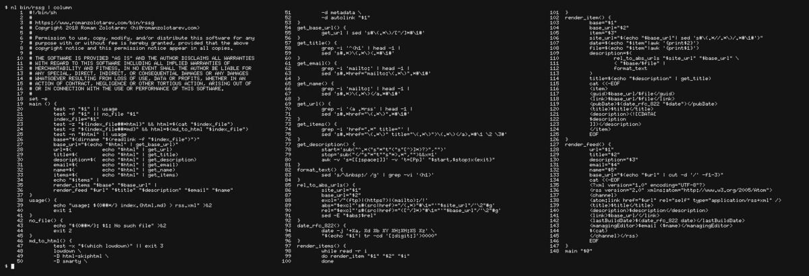

_Tested on [OpenBSD](/openbsd/) 6.3 and 6.4_

# Generate RSS feeds with grep(1), sed(1), and awk(1)

[rssg](/bin/rssg) is an RSS feed generator written in shell. It's
a good companion for [ssg](ssg.html).

It gets feed's description, URL, and the list of items
from an index file.

Then for every item it extracts its title and treats the rest of
the file as its description, replacing all relative URLs with
absolute ones.

An index file can be in HTML or in Markdown format.

Finally, _rssg_ outputs the feed in XML format.

_148 LoC. [grep and sed everything](rssg.png)_

## Install

Download and chmod it:

<pre>
$ <b>ftp -Vo bin/rssg https://www.romanzolotarev.com/bin/rssg</b>
rssg       100% |*********************|    4137      00:00
$ <b>chmod +x bin/rssg</b>
$ <b>doas pkg_add lowdown</b>
quirks-2.414 signed on 2018-03-28T14:24:37Z
lowdown-0.3.1: ok
$
</pre>

## Usage

<pre>
$ <b>rssg index.html 'title' &gt; rss.xml</b>
$
</pre>

Here is an example of a minimal `index.html` file:

<pre>
&lt;h1&gt;<b>People who run BSD</b>&lt;/h1&gt;

&lt;p&gt;<em>
Stories written by users of BSD operating systems.
Hosted by Roman Zolotarev.
</em>&lt;/p&gt;

&lt;p&gt;
Subscribe via &lt;a href="<b>https://bsdjobs.com/people/rss.xml</b>"&gt;RSS&lt;/a&gt;.
&lt;/p&gt;

&lt;ul&gt;
&lt;li&gt;&lt;a href="<b>mischapeters.html</b>" title="<b>2018-08-07</b>"&gt;<b>Mischa Peters</b>&lt;/a&gt;&lt;/li&gt;
&lt;li&gt;&lt;a href="<b>h3artbl33d.html</b>" title="<b>2018-08-06</b>"&gt;<b>h3artbl33d</b>&lt;/a&gt;&lt;/li&gt;
&lt;/ul&gt;
</pre>

HTML parsing rules:

- `<H1>` and `<A>` tags should not contain line breaks.
- **title** is the first `<H1>` tag.
- **description** is the first `
` tag. 
All `<H1>` tags are excluded from description.
- **url** is `HREF` attribute of the first `<A>` tag
with `RSS` content. 
- **items** are lines with `<A>` tags and `TITLE` attribute.
- **item file** is `HREF` attribute of that line, **item date** is
`TITLE` attribute, and **item title** is the content of `<A>` tag.

---

**Thanks** to [Devin Teske](https://twitter.com/devinteske) for
[her awk(1)
wizardry](https://twitter.com/freebsdfrau/status/1042076552400265219).
