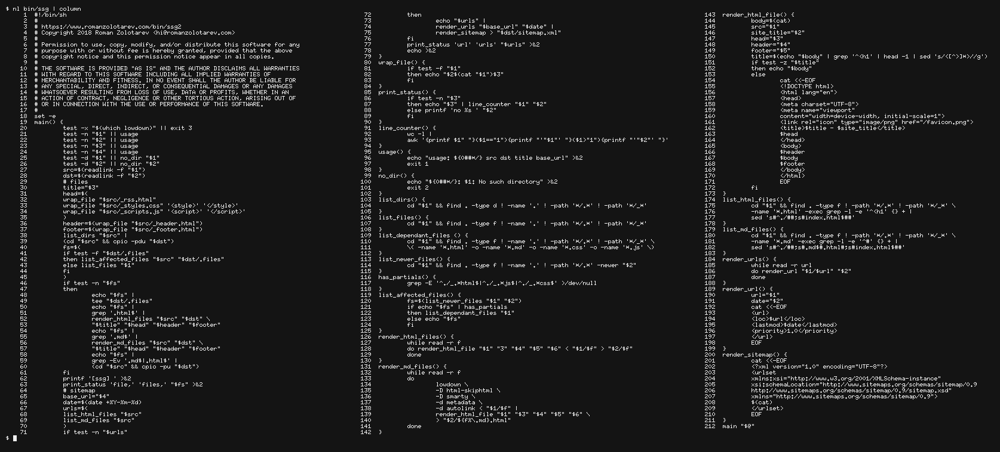

&#8220;I just found <b>ssg</b>!  You are so damn
cool.  I love your approach to things.&#8221;

 
**Derek Sivers** 
_Entrepreneur and Book Publisher_ 
[sivers.org](https://sivers.org "25 Apr 2018")

---

"SSG by @romanzolotarev is an impressively small static site
generator with a tiny installed footprint. Really good for when you
just need the core features." &mdash;
[Simon Dann](https://twitter.com/carbontwelve/status/1028936035143757825 "13 Aug 2018")
(@carbontwelve)

---

_Tested on [OpenBSD](/openbsd/) 6.3_

# Make a static site with find(1), grep(1), and lowdown(1)

[ssg2](/bin/ssg2) is a static site generator written in shell and powered by
[lowdown(1)](https://kristaps.bsd.lv/lowdown/).

It converts `*.md` files to HTML.

If a page has `<H1>` tag _ssg2_ extracts its title, wraps it
with `_header.html`, `_footer.html`, and injects `_styles.css`,
`_scripts.js`, `_rss.html` into `<HEAD>`.

Then copies everything (excluding `.*`, `CVS`, and `_*`) from `src`
to `dst` directory.

_212 LoC. [Enlarge, enhance, zoom!](ssg2.png)_

## Install

Download and chmod it:

<pre>
$ <b>ftp -Vo bin/ssg2 https://www.romanzolotarev.com/bin/ssg2</b>
ssg2       100% |*********************|    4137      00:00
$ <b>chmod +x bin/ssg2</b>
$ <b>doas pkg_add lowdown entr</b>
quirks-2.414 signed on 2018-03-28T14:24:37Z
lowdown-0.3.1: ok
entr-4.0: ok
$
</pre>

## Usage

<pre>
$ <b>mkdir src dst</b>
$ <b>echo '# Hello, World!' > src/index.md</b>
$ <b>echo '&lt;p&gt;&lt;a href="/"&gt;Home&lt;/a&gt;&lt;/p&gt;' &gt; src/_header.html</b>
$ <b>echo '&lt;p&gt;2018 Roman Zolotarev&lt;/p&gt;' &gt; src/_footer.html</b>
$ <b>ftp -Vo src/_styles.css https://www.romanzolotarev.com/style.css</b>
style.css  100% |**************************|  1020       00:00
$ <b>ssg2 src dst 'Test' 'https://www.romanzolotarev.com'</b>
index.html
_header.html
_footer.html
_styles.css
[ssg] 4 files
$ <b>firefox dst/index.html</b>
</pre>

## Incremental updates

On every run _ssg2_ saves a list of files in `dst/.files` and updates
only newer files. If no files were modified after that, _ssg2_ does
nothing.

<pre>
$ <b>ssg2 src dst 'Test'</b>
[ssg] ok
$
</pre>

To force the update delete `dst/.files` and re-run _ssg2_.

<pre>
$ <b>rm dst/.files</b>
$ <b>ssg2 src dst 'Test' 'https://www.romanzolotarev.com'</b>
index.html
_header.html
_footer.html
_styles.css
[ssg] 4 files
$
</pre>

## Watch

Save this helper to `~/bin/s`. It re-runs _ssg2_ with
[entr(1)](http://entrproject.org) on every file change.

<pre>
$ <b>cat ~/bin/s</b>
#!/bin/sh
while :
do find . -type f ! -path '*/.*' |
entr -d "$HOME/bin/ssg" . "$1" "$(date)" '//www'
done
$
</pre>

Start it and keep it running:

<pre>
$ <b>~/bin/s /var/www/htdocs/www</b>
[ssg] ok
</pre>

## Upgrade

_[Previous version of ssg](ssg1.html) has been retired._

Add a wrapper for `entr(1)`. 
Delete `_ssg.conf`. 
Add `_rss.html`(optionally). 
Update run script and `post-*` git hooks. 
Uninstall `rsync(1)`, if you don't use it.

`ssg1`                         | `ssg2`
:--                            | :--
&nbsp;                         | &nbsp;
**performance**                |
102 pp (31,306 words) 2.08s    | 1.61s
second run (+1 page)  1.92s    | **0.13s**
&nbsp;                         | &nbsp;
**features**                   |
`rss.xml`                      | _extracted to [rssg](rssg.html)_
`sitemap.xml`                  | _same_
&nbsp;                         | &nbsp;
**content**                    |
convert MD to HTML             | _same_
wrap HTML pages                | _same_
get title from `<h1>`          | _same_
`_header.html`                 | _same_
`_footer.html`                 | _same_
`_styles.css`                  | _same_
`_scripts.js`                  | _same_
&nbsp;                         | `_rss.html`
**command line and env**       |
env vars and `_ssg.conf`       | _removed_
&nbsp;                         | `DOCS` moved to 2rd argument
&nbsp;                         | `WEBSITE_TITLE`&mdash;to 3rd
`ssg build`                    | `ssg2 src dst ...`
`ssg build --clean`            | `cd dst && rm -rf * .* && ssg2 ...`
`ssg watch`                    | `cd src && find . | entr ssg2 ...`
&nbsp;                         | &nbsp;
**dependencies**               |
`lowdown`                      | _same_
`entr`                         | _removed_
`rsync`                        | _removed_

---

<pre>
&#9484;&#9472;&#9488;&#9484;&#9472;&#9488;&#9484;&#9472;&#9488;
&#9492;&#9472;&#9488;&#9492;&#9472;&#9488;&#9474; &#9516;
&#9492;&#9472;&#9496;&#9492;&#9472;&#9496;&#9492;&#9472;&#9496;
</pre>

---

**Thanks** to
[Mischa Peters](https://twitter.com/mischapeters) for testing and [using this version in production](https://openbsd.amsterdam/?rz),
[Kristaps Dzonsons](https://www.divelog.blue/) for
[lowdown(1)](https://kristaps.bsd.lv/lowdown/), and
[Eric Radman](http://eradman.com) for
[entr(1)](http://entrproject.org).
