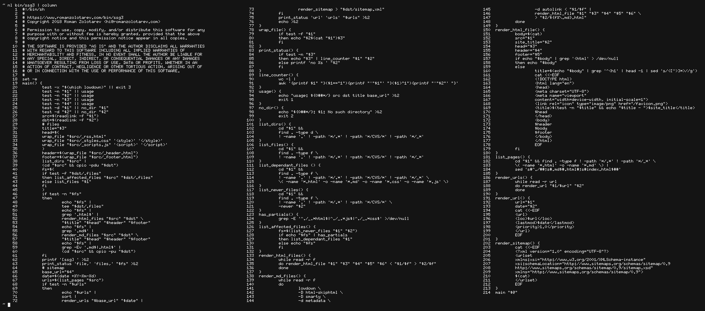

_Tested on [OpenBSD](/openbsd/) 6.3 and 6.4_

# Make a static site with find(1), grep(1), and lowdown(1)

[ssg](/bin/ssg3) is a static site generator written in shell. Optionally it
converts Markdown files to HTML with
[lowdown(1)](https://kristaps.bsd.lv/lowdown/).

Unless a page has `<HTML>` tag _ssg3_ extracts its title, wraps it
with `_header.html`, `_footer.html`, and injects `_styles.css`,
`_scripts.js`, `_rss.html` into `<HEAD>`.

Then copies everything (excluding `.*`, `CVS`, and `_*`) from `src`
to `dst` directory.

_214 LoC. [Enlarge, enhance, zoom!](ssg3.png)_

## Install

Download and chmod it:

<pre>
$ <b>mkdir -p bin</b>
$ <b>ftp -Vo bin/ssg3 https://www.romanzolotarev.com/bin/ssg3</b>
ssg3       100% |*********************|    5025      00:00
$ <b>chmod +x bin/ssg3</b>
$ <b>doas pkg_add lowdown</b>
quirks-2.414 signed on 2018-03-28T14:24:37Z
lowdown-0.3.1: ok
$
</pre>

lowdown(1) is optional. It's required only if there are
any `*.md` files.

## Usage

<pre>
$ <b>mkdir src dst</b>
$ <b>echo '# Hello, World!' > src/index.md</b>
$ <b>echo '&lt;p&gt;&lt;a href="/"&gt;Home&lt;/a&gt;&lt;/p&gt;' &gt; src/_header.html</b>
$ <b>echo '&lt;p&gt;2018 Roman Zolotarev&lt;/p&gt;' &gt; src/_footer.html</b>
$ <b>ftp -Vo src/_styles.css https://www.romanzolotarev.com/style.css</b>
style.css    100% |**************************|  1020       00:00
$ <b>bin/ssg3 src dst 'Test' 'https://www'</b>
./index.md
[ssg] 1 file, 1 url
$ <b>find dst</b>
dst
dst/.files
dst/index.html
dst/sitemap.xml
$ <b>open dst/index.html</b>
</pre>

## Markdown and HTML files

_ssg3_ renders Markdown files first and then HTML files. In the
following example `src/a.html` wins:

	src/a.md   -> dst/a.html
	src/a.html -> dst/a.html

## Favicon

Every page wrapped by _ssg3_ has this HTML.

	<!DOCTYPE html>
	<html lang="en">
	<head>
	<meta charset="UTF-8">
	<meta name="viewport"
	content="width=device-width, initial-scale=1">
	<link rel="icon" type="image/png" href="/favicon.png">

So make sure you have `/favicon.png` in place.

Some browsers fetch `/favicon.ico` despite what you specified in
the `<LINK>` tag, so you can use [an empty one](/favicon.ico) (180
bytes) as a placeholder.

## JavaScript

To inject JS to all pages add it to `_scripts.js`.
I recommend to avoid JS whenever possible, though.

## CSS

To inject CSS to all pages add it to `_styles.css`. 
Use my [_styles.css](/style.css) as a starting point.

## Sitemap

_ssg3_ generates `sitemap.xml` with the list of all page.  Don't
forget to add absolute URL of the sitemap to your `robot.txt`. For
example:

	user-agent: *
	sitemap: https://www.romanzolotarev.com/sitemap.xml

## RSS

To generate RSS feeds use [rssg](rssg.html), then add their URLs
to `_rss.xml`. For example:

	<link rel="alternate" type="application/atom+xml" href="/rss.xml">

## Incremental updates

On every run _ssg3_ saves a list of files in `dst/.files` and updates
only newer files. If no files were modified after that, _ssg3_ does
nothing.

<pre>
$ <b>bin/ssg3 src dst 'Test' 'https://www'</b>
[ssg] no files, 1 url
$
</pre>

To force the update delete `dst/.files` and re-run _ssg3_.

<pre>
$ <b>rm dst/.files</b>
$ <b>bin/ssg3 src dst 'Test' 'https://www'</b>
index.md
[ssg] 1 file, 1 url
$
</pre>

## Watch

Save this helper to `~/bin/sssg`. It re-runs _ssg3_ with
[entr(1)](http://entrproject.org) on every file change.

<pre>
$ <b>cat $HOME/bin/sssg</b>
#!/bin/sh
while :
do
	find . -type f ! -path '*/.*' |
	entr -d "$HOME/bin/ssg3" . "$1" "$(date)" '//www'
done
$
</pre>

Install entr(1):

<pre>
$ <b>doas pkg_add entr</b>
quirks-2.414 signed on 2018-03-28T14:24:37Z
entr-4.0: ok
$
</pre>

Start the helper and keep it running:

<pre>
$ <b>~/bin/s /var/www/htdocs/www</b>
[ssg] 1 file, 1 url
</pre>

## Upgrade

_[Previous version of ssg](ssg2.html) has been retired._

Add `<HTML>` tag for pages your want to be excluded from parsing.
If you don't use `*.md` files you can uninstall lowdown(1).

_ssg2_                       | _ssg3_
:--                          | :--
Wraps pages with `<H1>` tag. | Doesn't wrap pages with `<HTML>` tag.
lowdown(1) is required.      | lowdown(1) is optional.

## Dependencies

_ssg3_ depends on few programs from OpenBSD base:

<pre>
$ <b>for f in $(which cat cpio date sh awk find grep printf readlink sort tee wc)</b>
<i><b>do ldd "$f"</b></i>
<i><b>done | awk '/\//{print$7}' | grep '.' | sort -u</b></i>
/bin/cat
/bin/cpio
/bin/date
/bin/sh
/usr/bin/awk
/usr/bin/find
/usr/bin/grep
/usr/bin/printf
/usr/bin/readlink
/usr/bin/sort
/usr/bin/tee
/usr/bin/wc
/usr/lib/libc.so.92.5
/usr/lib/libm.so.10.1
/usr/lib/libutil.so.13.0
/usr/lib/libz.so.5.0
/usr/libexec/ld.so
</pre>

---

<pre>
&#9484;&#9472;&#9488;&#9484;&#9472;&#9488;&#9484;&#9472;&#9488;
&#9492;&#9472;&#9488;&#9492;&#9472;&#9488;&#9474; &#9516;
&#9492;&#9472;&#9496;&#9492;&#9472;&#9496;&#9492;&#9472;&#9496;
</pre>

## Users and forks

[blog.solobsd.org](https://blog.solobsd.org/) 
[bsdjobs.com](https://www.bsdjobs.com/) 
[cryogenix.net](https://cryogenix.net) 
[grosu.nl](https://grosu.nl/) 
[high5.nl](https://high5.nl/) 
[matthewgraybosch.com](https://matthewgraybosch.com/) 
[mvidal.net](https://mvidal.net/) 
[openbsd.amsterdam](https://openbsd.amsterdam/?rz) 
[openbsd.space](https://openbsd.space/) 
[romanzolotarev.com](https://www.romanzolotarev.com/) &mdash; obviously ;) 
[runbsd.info](https://runbsd.info/) 
[stockersolutions.com](https://www.stockersolutions.com/) 

---

**Thanks** to
[Kristaps Dzonsons](https://www.divelog.blue/) for
[lowdown(1)](https://kristaps.bsd.lv/lowdown/) and
[Eric Radman](http://eradman.com) for
[entr(1)](http://entrproject.org).
