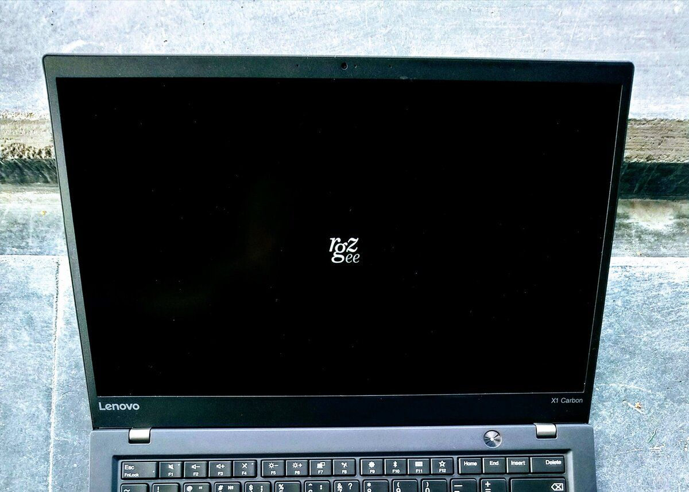

_Tested with [ThinkPad](/thinkpad/) X1 Carbon Gen 5 and [OpenBSD](/openbsd/) 6.6-beta_

**WARNING** 
Flashing the BIOS incorrectly may lead to an unusable system. Follow these instructions at your own risk.

# Flash ThinkPad BIOS and boot logo

[Find and download BIOS Update](https://pcsupport.lenovo.com/us/en) for ThinkPad X1 Carbon (for example, `n1mur23w` works for types 20HQ, 20HR, 20K3,
20K4, version 1.40, released 16 Jul 2019, 23MB).

Make a bootable USB drive with `geteltorito` and `dd`.

Prepare [an image of a boot logo](logo.gif) based on requirements from
`FLASH/README.TXT` (size: up to 60KB, format: GIF) and copy it to the
USB drive.

Boot from the USB drive and follow the instructions.

<pre>
# <b>cd /tmp</b>
# <b>ftp -V https://download.lenovo.com/pccbbs/mobiles/n1mur23w.iso</b>
n1mur23w.iso 100% |**************************| 23916 KB    00:09
# <b>ftp -V https://rgz.ee/thinkpad/bios.SHA256</b>
bios.SHA256  100% |**************************|    89       00:00
# <b>sha256 -C bios.SHA256 <em>n1mur23w.iso</em></b>
(SHA256) n1mur23w.iso: OK
# <b>pkg_add geteltorito</b>
quirks-3.172 signed on 2019-08-20T12:39:11Z
geteltorito-0.6: ok
# <b>geteltorito -o <em>n1mur23w.img</em> <em>n1mur23w.iso</em></b>
Booting catalog starts at sector: 20
Manufacturer of CD: NERO BURNING ROM
Image architecture: x86
Boot media type is: harddisk
El Torito image starts at sector 27 and
has 47104 sector(s) of 512 Bytes

Image has been written to file "n1mur23w.img".
# <b>dd if=<em>n1mur23w.img</em> of=/dev/<em>rsd3c</em> bs=1m</b>
23+0 records in
23+0 records out
24117248 bytes transferred in 2.138 secs (11276684 bytes/sec)
# <b>mkdir /mnt/<em>sd3i</em></b>
# <b>mount /dev/<em>sd3i</em> /mnt/<em>sd3i</em></b>
# <b>ftp -V https://rgz.ee/thinkpad/logo.gif</b>
logo.gif     100% |**************************|  4555       00:00
# <b>cp <em>logo.gif</em> /mnt/<em>sd3i</em>/FLASH/LOGO.GIF</b>
# <b>umount /dev/<em>sd3i</em></b>
# <b>reboot</b>
</pre>
