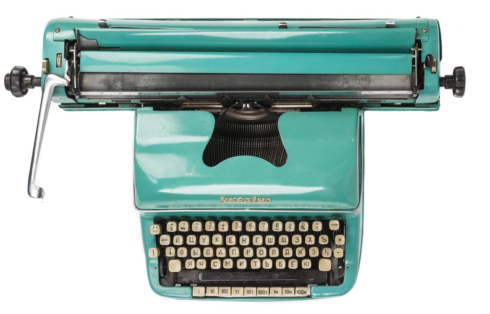
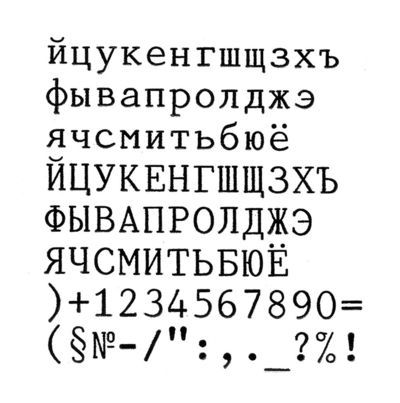

# Mechanical typewriter Ukraina

<pre>
Cyrillic type, incl. lowercase
Fixed-width characters
&#1081;&#1094;&#1091;&#1082;&#1077;&#1085; layout
Tabulation
Black dried ink tape
Made in Ufa, USSR
</pre>

Print sample made with a _similar_ typewriter:

 

This is the first keyboard I saw and tried in my life.

[I've been typing](typing.html) almost every day since age of twelve.
Thanks to my mum I had a moment of a brief introduction to the
concept of a keyboard and type at age of five.

_Photo by Claude Monet via [Thngs](https://thngs.co/things/8596)_
